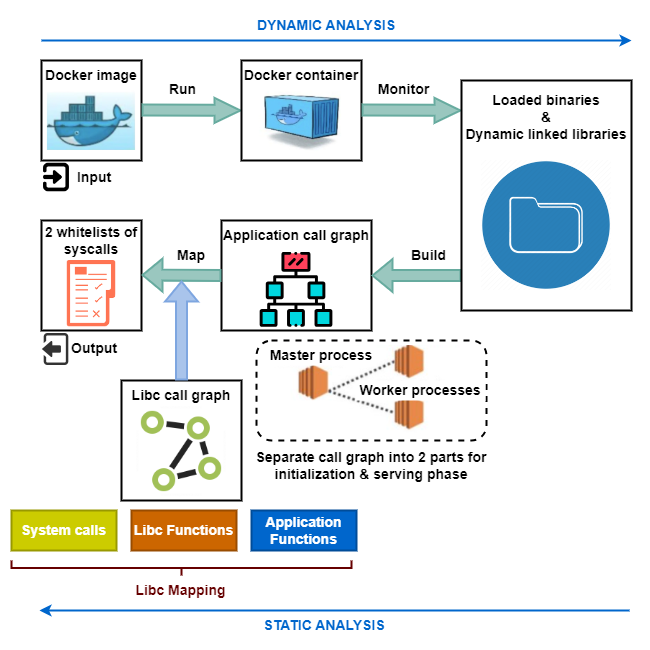
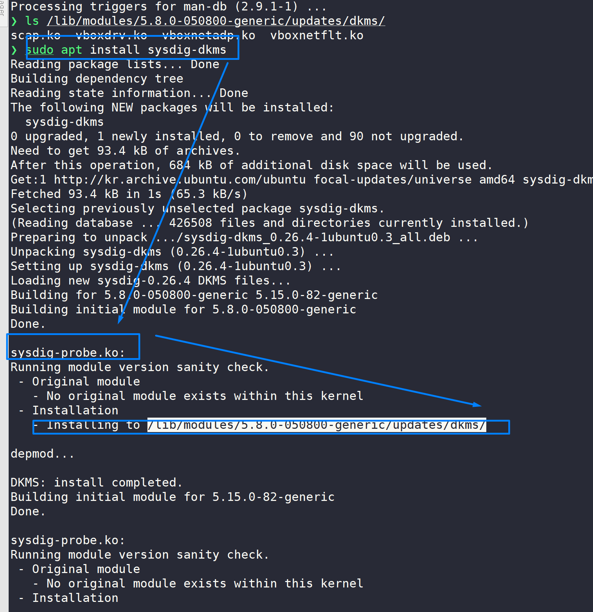
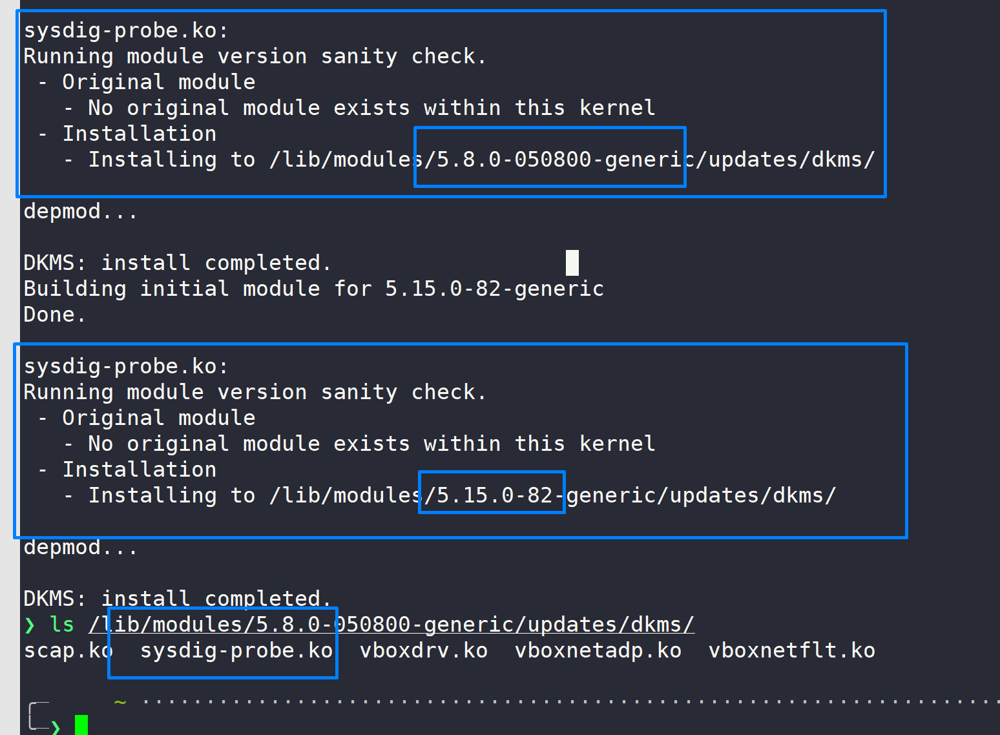
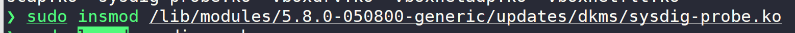
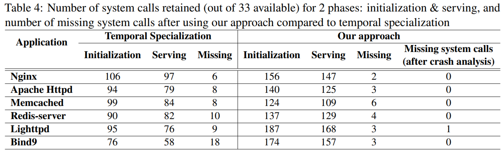
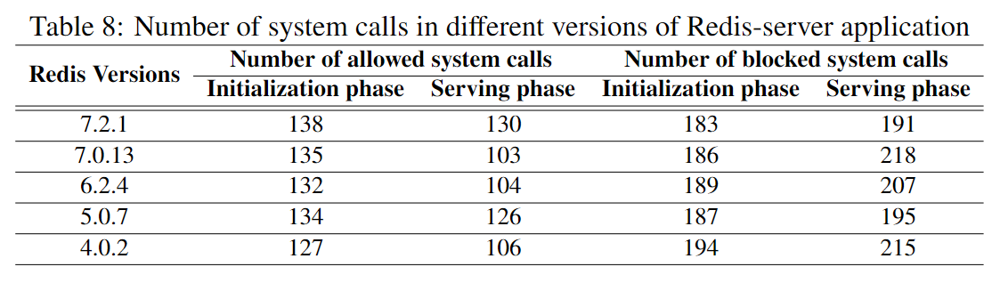

<p align="center">
 
 <h2 align="center">Seccomp Profile Refinement Readme! </h2>
</p>

| The aim of this repository is a proposal of building a precise system call whitelist to avoid the over-privilege issue for containerized applications at two different execution phases: the initialization and the serving phases. |  |
|----------------------------------------------------------------------------------------------------------------------------------------------------------------------------------------------------------------------------------------------------------------------------------------------------------------------------------------------------------------------------------------------------------------------------------------------------------------------------------------------------------------------|--------------------------------------------------------------------------:|

# TABLE OF CONTENTS
- [Background](#background)
- [Setup](#setup)
- [Usage](#usage)
- [Experiment results]()

# BACKGROUND 
## Research paper
We present our approach and the findings of this work in the following research paper:
**Refining Seccomp Security Profile for Container Hardening** - *Mobisec Conference 2022* & the completed and extended version **Towards Secure Containerized Applications with Seccomp Profile Refinement**, *1st Reviewed in Computers & Security Journal*.
## Overall Architecture


- **Input**: Image is pulled from Docker-hub with the information is saved to a json file

- **Dynamic analysis**: run container with a configurable time (60 seconds); then use Sysdig tool to monitor container and collect binaries & libraries in runtime

- **Static analysis**: use source code + binaries & libs to build an application call graph (LLVM compiler + SVF tool + binary analysis); utilize Glibc to map between functions to system calls

- **Output**: Seccomp profiles contains 2 whitelists of system calls corresponding initialization and serving phase

# SETUP

## Requirements
- Ubuntu 20.04 64-bit
- Docker version 20.10.21
- [Sysdig](https://sysdig.com/) version 0.33.0

## Sysdig Installation
```
    $ sudo -s
    $ apt install sysdig    #auto install the newest version
    $ apt install dkms      #install dependencies
    $ apt install sysdig-dkms    # build sysdig-probe module
```
Example: 



Then, check the sysdig-probe module under the directory:



Install this module to kernel using `insmod`



Check the status of sysdig-probe module to make sure successful installation
```
    $ lsmod | grep sysdig
    =========> sysdig-probe.ko
```

**Note: if you have any issues related to Sysdig while installing or using, please refer to this [link](https://github.com/nguyenvulong/QA/issues/31) to solve the problems**

## Bitcode Generation
- Source codes are compressed under .tar.gz files using command:
```
    $ tar -czvf $SOURCE_CODE_FOLDER $SOURCE_CODE_FOLDER.tar.gz
```
- Decompress using `tar -zvf $SOURCE_CODE_FOLDER.tar.gz`
- Move the `.0.5.precodegen.bc` to the bitcodes folder for the next steps

# USAGE 
## 1. Run dynamic analysis
```
    $ cd ./script
    $ sudo su 
    $ ./dynamic.sh 
```
**Note:**
- Please make sure you have the root previlege. You have to run dynamic analysis using root.
- The default is *Nginx* application. If you want to apply to other applications, let's change the name of application.

The dynamic binaries & libraries will be stored under the directory: ```test-output/{application-name}```

## 2. Run static analysis
```
    $ ./setup.sh
    $ ./static.sh
```
**Note:**
- For static analysis, we need to have application's bitcode file as the input of this process

# EXPERIMENT RESULTS

Please refer to the paper to understand details of our experiment.
## 1. System call filtering


## 2. VERSION COMPARISION
- Nginx application: 


- Redis-server application: 




